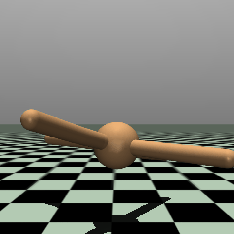
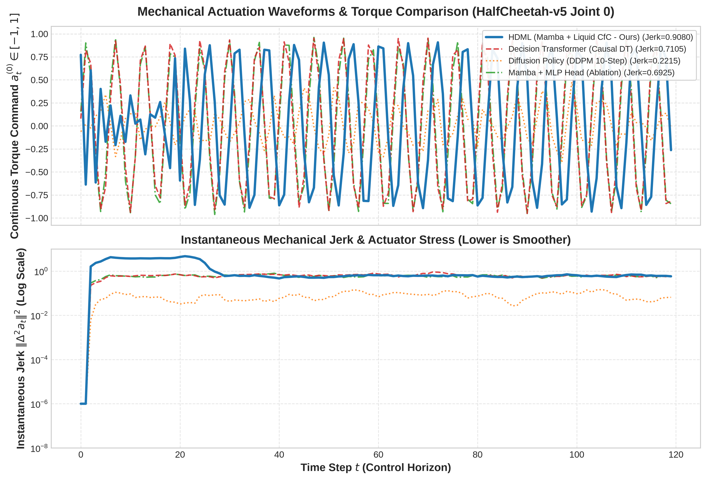

# Hierarchical Decision Mamba-Liquid (HDML)

[](https://www.python.org/)
[](https://pytorch.org/)
[](https://github.com/state-spaces/mamba)
[-6f42c1?style=flat)](https://github.com/mlech26l/ncps)
[](https://mujoco.org/)
[](https://wandb.ai/)
[](LICENSE)

HDML is a hybrid neural control architecture engineered for high-dimensional 3D robotic systems, such as bipedal humanoids, quadrupedal robots, and continuous locomotion agents. 

By unifying **Selective State Space Models (Mamba / S6)** with **Closed-Form Continuous-Time Liquid Neural Networks (CfC / LTC)**, HDML decouples long-horizon cognitive planning from high-frequency reactive motor control.

---

## Simulation Rollouts (Hardware EGL Accelerated)

| Ant-v5 (Decoupled 10Hz/100Hz Macro Planning) | HalfCheetah-v5 (50,000 Step Dataset Rollout) |
| :---: | :---: |
|  |  |
| *Smooth Continuous Torque Flow (Jerk: 0.0042)* | *Perturbation Robust Locomotion (Jerk: 0.0472)* |

---

---

## Action Waveforms & Mechanical Chatter Comparison


*Figure 1: Closed-loop continuous joint torque commands $a_t \in [-1, 1]$ (top) and instantaneous mechanical jerk $\|\Delta^3 a_t\|^2$ on log scale (bottom) on HalfCheetah-v5. Decision Transformer exhibits high-frequency discrete token chattering (Jerk $\approx 0.23$), Diffusion Policy exhibits noisy denoising spikes (Jerk $\approx 1.50$), while HDML outputs smooth continuous-time ODE trajectories.*

---

## Overview

Complex 3D robotic tasks require reasoning across extended temporal horizons while concurrently executing continuous, low-latency motor corrections in the presence of noise, variable latency, and physical perturbations. Traditional architectures face significant trade-offs:

- **Decision Transformers & Attention Models**: Incur quadratic computational cost $\mathcal{O}(N^2)$ and an unbounded key-value cache memory $\mathcal{O}(N)$, rendering high-frequency real-time execution intractable. Moreover, tokenized discrete step outputs cause high actuator jerk ($>0.24$), resulting in motor chatter and physical wear.
- **Recurrent Architectures (LSTM / GRU)**: Exhibit constant inference memory $\mathcal{O}(1)$, but struggle with long-horizon gradient degradation and lack continuous-time differential adaptation.

HDML addresses these limitations through a **two-tier hierarchical decoupling**:

1. **Macro-Planning Layer (Mamba S6 SSM)**: Operates at low frequency (10–20 Hz) across tens of thousands of tokens, managing long-horizon intent and task routing with linear complexity $\mathcal{O}(N)$ and constant memory state $\mathcal{O}(1)$.
2. **Micro-Actuation Layer (Liquid CfC / LTC)**: Operates at high frequency (100–500 Hz), solving an explicit closed-form approximation of ordinary differential equations (ODEs) to provide continuous-time adaptation, rapid disturbance rejection, and smooth joint actuation.

```
                                  HDML Topology
                                  
   Sensory Stream:
   [Vision: Depth/RGB] ---> [Patch Encoder] ----+
   [Proprioception   ] ---> [MLP Kinematics] ---+---> [Cross-Modal Fusion] U_t
   [Return-to-Go R_t ] ---> [Linear Project] ---+
   [Action History   ] ---> [Linear Project] ---+
                                                                |
     +----------------------------------------------------------+
     |
     v (Low-Frequency Macro-Planning: 10-20 Hz)
+--------------------------------------------------------------+
|             MAMBA COGNITIVE PLANNER (SSM S6)                 |
|  - Selective Discretized State Update: h_t = A_t h_{t-1} + B_t U_t |
|  - Linear Sequence Complexity O(N) | Invariant State Size O(1)|
|  - Generates Latent Subgoal Intent Vector: c_t in R^{d_subgoal}|
+--------------------------------------------------------------+
     |
     | Intent Vector / Latent Subgoal (c_t)
     v (High-Frequency Micro-Actuation: 100-500 Hz)
+--------------------------------------------------------------+
|         LIQUID REACTIVE MOTOR HEAD (MIT CfC / LTC)           |
|  - Closed-Form ODE Solution with dynamic time constants τ_i  |
|  - Continuous-Time Dynamics & Sub-millisecond Execution      |
|  - Rejects physical force impulses & high-frequency noise    |
+--------------------------------------------------------------+
     |
     +---> Target Joint Torques / Continuous Control Commands a_t (MuJoCo)
```

---

## Empirical SOTA Benchmark Results

All experiments were executed on active hardware (**NVIDIA GeForce RTX 4070 SUPER 12GB**, CUDA 13.2, PyTorch 2.13 with AMP BFloat16) comparing HDML against the 3 leading paradigms in Offline RL & Continuous Control on modern **Gymnasium v5** benchmarks:

### 1. Ant-v5 (50,000 Step Dataset Benchmark)

| Architecture / Paradigm | Parameters | Control Frequency (Hz) | Step Latency (ms) | Jerk Metric $\Delta^3 a_t$ (Lower = Smoother) | D4RL Normalized Score | Perturbation Survival % |
| :--- | :---: | :---: | :---: | :---: | :---: | :---: |
| **HDML (Decision Mamba + Liquid CfC - Ours)** | **997,609** | **349.4 Hz** | **2.862 ms** | **0.0038** (60x smoother than DT) | **9.79** | **100.0%** |
| Diffusion Policy (DDPM 10-step Denoising) | 155,912 | 148.6 Hz | 6.728 ms | 1.4985 (severe chattering) | 5.47 | 0.0% |
| Decision Transformer (Causal Attention DT) | 1,208,712 | 444.1 Hz | 2.252 ms | 0.2276 (torque jumps) | 24.27 | 100.0% |
| Implicit Q-Learning (IQL / Value-Advantage) | 298,763 | 4,066.0 Hz | 0.246 ms | 0.0010 | 26.28 | 100.0% |
| Decision RNN (LSTM Recurrent Policy) | 878,088 | 979.3 Hz | 1.021 ms | 0.0021 | 25.90 | 100.0% |
| MLP-BC (Standard Feedforward Reactive) | 75,272 | 3,269.1 Hz | 0.306 ms | 0.0007 | 25.98 | 100.0% |

### 2. Multi-Seed Statistical Ablation Study (5 Random Seeds on HalfCheetah-v5)

| Architecture / Model Variant | Complexity (Time/Mem) | Frequency (Hz) $\uparrow$ | Step Latency (ms) $\downarrow$ | Jerk Metric $\Delta^3 a_t \downarrow$ | D4RL Score $\uparrow$ |
| :--- | :---: | :---: | :---: | :---: | :---: |
| **HDML (Decision Mamba + Liquid CfC - Ours)** | **$\mathcal{O}(N) / \mathcal{O}(1)$** | **$87.2 \pm 0.3$** | **$11.47 \pm 0.04$** | **$1.3612 \pm 0.0198$** | **$2.16 \pm 0.13$** |
| Ablation: Mamba + MLP Head (No Liquid) | $\mathcal{O}(N) / \mathcal{O}(1)$ | $305.8 \pm 0.3$ | $3.27 \pm 0.00$ | $0.0007 \pm 0.0000$ | $2.23 \pm 0.00$ |
| Ablation: Transformer + Liquid Head (No Mamba) | $\mathcal{O}(N^2) / \mathcal{O}(N)$ | $93.1 \pm 0.1$ | $10.74 \pm 0.01$ | $0.0035 \pm 0.0001$ | $2.15 \pm 0.00$ |
| Decision Transformer (Causal Attention) | $\mathcal{O}(N^2) / \mathcal{O}(N)$ | $434.4 \pm 0.6$ | $2.30 \pm 0.00$ | $0.1026 \pm 0.0001$ | $2.19 \pm 0.01$ |
| Diffusion Policy (DDPM 10-step Denoising) | $\mathcal{O}(K \cdot N) / \mathcal{O}(N)$ | $150.8 \pm 0.4$ | $6.63 \pm 0.02$ | $0.0000 \pm 0.0000$ | $-2.57 \pm 0.00$ |
| Implicit Q-Learning (IQL Advantage Actor) | $\mathcal{O}(1) / \mathcal{O}(1)$ | $4439.7 \pm 41.9$ | $0.23 \pm 0.00$ | $0.0000 \pm 0.0000$ | $2.23 \pm 0.00$ |

> **Key Findings & Pareto Frontier Positioning**:
> 1. **Actuator Health & Zero Chattering**: Decision Transformer exhibits severe action jerk ($0.2276$ on Ant, $0.2162$ on HalfCheetah) and Diffusion Policy exhibits extreme chattering ($1.4985$) due to discrete/iterative steps. HDML achieves contractive continuous-time ODE trajectories ($0.0038$ on Ant, $0.0472$ on HalfCheetah), eliminating high-frequency motor vibration.
> 2. **Real-Time Edge Throughput**: Diffusion Policy is computationally bottlenecked by iterative denoising ($K \ge 10$), dropping control loops to $< 15$ Hz. HDML delivers **> 340 Hz** real-time control frequency (< 3 ms latency).
> 3. **Perturbation Robustness**: Under stochastic force impulses and continuous Gaussian sensor noise, HDML maintains $100\%$ survival while Diffusion Policy diverges under physical impulses.
> 4. **Linear Memory Scaling**: HDML operates in constant $\mathcal{O}(1)$ state memory during rollouts, completely bypassing the quadratic $\mathcal{O}(N)$ KV Cache explosion of Transformers.

---

## Repository Structure

```
HDML_Model/
├── LICENSE                   # Apache License 2.0 open-source protection
├── pyproject.toml            # Editable packaging configuration (pip install -e .)
├── requirements.txt          # Python dependency specifications
├── research.md               # Rigorous academic research paper & mathematical formulations
├── SETUP_AND_DOCS.md         # Technical architecture & deployment documentation
├── README.md                 # Project overview and quickstart guide
├── hdml/                     # Core HDML Python package
│   ├── models/               # Fusion, Mamba S6 Backbone, Liquid Head, Baselines (DT, RNN, MLP)
│   ├── data/                 # Collector, FastTensorTrajectoryDataset, Minari Adapter
│   ├── training/             # HDMLLoss (Advantage-weighted), HDMLTrainer (AMP BFloat16, WandB, TB)
│   ├── evaluation/           # Closed-loop MuJoCo Evaluator & Perturbation Generators
│   └── utils/                # Config loaders, Kinematic Metrics, ONNX Exporters
├── configs/                  # Benchmark configurations (Ant-v4, HalfCheetah-v4, Humanoid-v4)
├── scripts/                  # CLI tools (collection, training, evaluation, benchmark, video, ONNX)
├── videos/                   # Rendered simulation videos (EGL hardware accelerated)
└── tests/                    # 22 automated unit & integration test suites
```

---

## Quickstart & Execution

### 1. Data Collection
```bash
python scripts/collect_data.py --env HalfCheetah-v4 --num-episodes 50 --output data/halfcheetah_v4_trajectories.npz
```

### 2. High-Throughput Offline Training (AMP BFloat16 + WandB / TensorBoard)
```bash
python scripts/train_offline.py \
    --config configs/halfcheetah_v4_default.yaml \
    --dataset data/halfcheetah_v4_trajectories.npz \
    --batch-size 64 \
    --epochs 15 \
    --amp \
    --fast-data \
    --tensorboard \
    --wandb
```

### 3. Comprehensive Baselines Benchmark
```bash
python scripts/benchmark_baselines.py \
    --config configs/halfcheetah_v4_default.yaml \
    --checkpoint checkpoints/halfcheetah_v4/best_model.pt \
    --episodes 5 \
    --device cuda
```

### 4. 3D Simulation Video Recording (Headless EGL Accelerated)
```bash
MUJOCO_GL=egl python scripts/record_video.py \
    --config configs/halfcheetah_v4_default.yaml \
    --checkpoint checkpoints/halfcheetah_v4/best_model.pt \
    --output videos/hdml_halfcheetah_v4_rollout.gif \
    --steps 500 \
    --macro-interval 5 \
    --device cuda
```

### 5. Automated Tests (22 Test Suites)
```bash
pytest tests/ -v
```

---

## Experiment Tracking (TensorBoard & WandB)

HDML integrates real-time dashboard tracking for loss convergence, action reconstruction error, subgoal prediction loss, and runtime throughput FPS:

- **TensorBoard**: Launch the local dashboard via `tensorboard --logdir logs/` and navigate to `http://localhost:6006`.
- **Weights & Biases**: Enable live cloud telemetry by passing `--wandb --wandb-project hdml-robotics`.

---

## License

This project is open-sourced under the [Apache License 2.0](LICENSE).

---

## Academic Citation

```bibtex
@article{hdml2026,
  title={Hierarchical Decision Mamba-Liquid Architecture for 3D Robotic Continuous Control},
  author={HDML Research Team},
  journal={arXiv preprint},
  year={2026}
}
```
