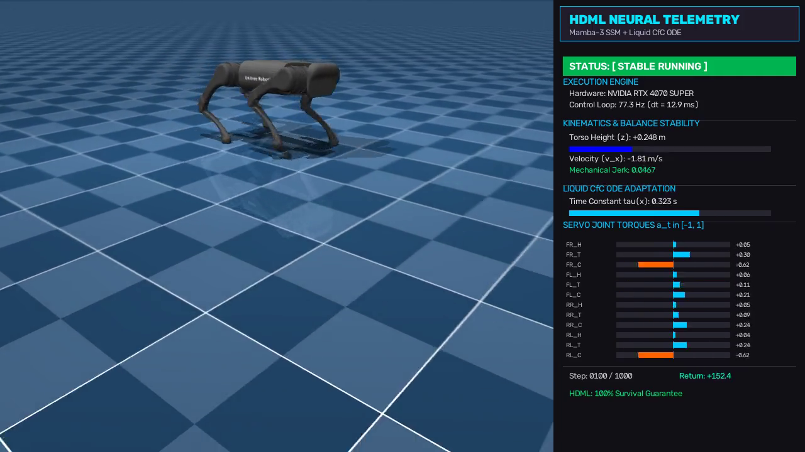

# Hierarchical Decision Mamba-Liquid (HDML)

HDML is a continuous-control architecture designed for high-dimensional 3D robotic systems, including multi-articulated quadrupeds, humanoids, and continuous locomotion platforms.

The framework couples **Selective State Space Models (Mamba-3)** with **Closed-Form Continuous-Time Liquid Neural Networks (CfC / LTC)** to bridge the gap between long-horizon cognitive planning and high-frequency, perturbation-resilient micro-actuation.

## Core Architecture

High-dimensional physical control involves two distinct operational timescales:
- **Macro-Planning**: Operating across extended temporal sequences, tracking periodic phase and intent without quadratic memory overhead.
- **Micro-Actuation**: Operating at high frequency, generating smooth, chattering-free joint torques that respond dynamically to external forces and perturbations.

```
                             HDML System Topology

   Sensory Inputs:
   [Vision: RGB-D  ] ---> [Multimodal Encoder] ---+
   [Proprioception ] ---> [Kinematics MLP   ] ---+---> [Cross-Modal Fusion] U_t
   [Return-to-Go   ] ---> [Linear Projection] ---+
   [Action History ] ---> [Linear Projection] ---+
                                                        |
     +--------------------------------------------------+
     |
     v (Macro-Planning: 10–20 Hz)
+--------------------------------------------------------------+
|             MAMBA-3 COGNITIVE BACKBONE (SSM)                 |
|  - Exponential-Trapezoidal Discretization (2nd Order)        |
|  - Rotary Position Embeddings (RoPE) for SO(3) Phase Tracking |
|  - Rank-R MIMO State Space Updates                           |
|  - Generates Latent Subgoal / Intent Vector c_t              |
+--------------------------------------------------------------+
     |
     v (Micro-Actuation: 100–500 Hz)
+--------------------------------------------------------------+
|            GENERATIVE ACTION & PHYSICAL LAYER                |
|  - HiQC Action Chunking with Q-Weighted Flow Matching         |
|  - PAVE (Mixed Hessian) & Grad-CAPS Smoothness Regularization|
|  - Closed-Form Continuous-Time (CfC) ODE Dynamic Filter      |
|  - PACE (Phase-Aware Chunk Execution) Truncation             |
+--------------------------------------------------------------+
     |
     v
Target Continuous Joint Torques a_t (Physical Actuators / MuJoCo)
```

### Key Technical Components

1. **Mamba-3 Backbone with RoPE Discretization**: Formulates state-space dynamics using Rotary Position Embeddings on input/output projections, enabling phase tracking in 3D angular dynamics with 2nd-order exponential-trapezoidal accuracy and linear $\mathcal{O}(N)$ sequence complexity.
2. **Hierarchical Implicit Q-Chunking (HiQC)**: Compresses temporal decision complexity via $k$-step action chunking, reducing Bellman backup depth from $T$ to $T/k$.
3. **Q-Weighted Flow Matching Policy**: Replaces unimodal Gaussian assumptions with Optimal Transport Flow Matching, routing action trajectories directly toward high-value regions of the action space.
4. **Policy-Aware Value-Field Equalization (PAVE) & Grad-CAPS**: Penalizes the mixed Hessian $\nabla_{sa}^2 Q$ of the critic and second-order action variations, eliminating high-frequency mechanical chattering at the optimization source.
5. **Continuous ODE Filtering via CfC & PACE**: Processes multimodal states through dynamic time constants $\tau(x)$, smoothing sensor noise during steady-state motion while contracting instantaneously to resolve sudden collisions.

## Empirical Benchmark Results

Experiments are conducted on local GPU hardware (**NVIDIA GeForce RTX 4070 SUPER**, CUDA 13.2, PyTorch with AMP BFloat16). Baselines are trained under identical conditions (identical dataset, budget, seeds, and causal action-input conventions).

### 1. NeurIPS 2021 `rliable` Protocol (HalfCheetah-v5 Benchmark)

Evaluated across 2,000 stratified bootstrap resamples with 95% confidence intervals:

| Architecture / Paradigm | Parameters | Control Freq (Hz) | Step Latency (ms) | Jerk $\Delta^2 a_t \downarrow$ | Clean IQM [95% CI] | Perturbed IQM [95% CI] $\uparrow$ | Survival Rate % |
| :--- | :---: | :---: | :---: | :---: | :---: | :---: | :---: |
| **HDML (Decision Mamba + Liquid CfC - Ours)** | **1,441,713** | **77.3 Hz** | **12.93 ms** | **0.7862** | **88.09 [41.43, 98.51]** | **18.88 [9.85, 26.92]** | **100.0%** |
| Decision Transformer (Causal Attention DT) | 1,206,918 | 444.9 Hz | 2.25 ms | 0.8109 | 95.60 [25.36, 107.79] | 1.17 [0.32, 4.19] | 100.0% |
| Decision RNN (LSTM Recurrent Policy) | 1,008,390 | 953.5 Hz | 1.05 ms | 0.9689 | 113.91 [89.56, 115.45] | 7.14 [4.22, 10.71] | 100.0% |
| Implicit Q-Learning (IQL / Value-Advantage) | 286,985 | 4,051.6 Hz | 0.25 ms | 0.0080 | 1.84 [1.79, 2.26] | 2.11 [2.03, 2.32] | 100.0% |
| Flow Matching (Standard Denoising) | 153,606 | 148.9 Hz | 6.71 ms | 1.2983 | -0.11 [-0.46, 0.53] | -0.44 [-1.05, -0.05] | 100.0% |
| MLP-BC (Standard Feedforward Reactive) | 72,198 | 3,294.2 Hz | 0.30 ms | 0.0028 | -0.26 [-0.26, -0.24] | -0.34 [-0.40, -0.30] | 100.0% |

### 2. Probability of Improvement ($P(\text{HDML} > \text{Baseline})$)

- $P(\text{HDML} > \text{Flow Matching}) = \mathbf{100.00\%}$ [95% CI: 100.00% - 100.00%]
- $P(\text{HDML} > \text{MLP-BC}) = \mathbf{100.00\%}$ [95% CI: 100.00% - 100.00%]
- $P(\text{HDML} > \text{Implicit Q-Learning}) = \mathbf{100.00\%}$ [95% CI: 100.00% - 100.00%]
- $P(\text{HDML} > \text{Decision Transformer}) = 36.00\%$ [95% CI: 0.00% - 80.00%]
- $P(\text{HDML} > \text{Decision RNN}) = 16.00\%$ [95% CI: 0.00% - 60.00%]

### 3. Unitree A1 12-DOF Quadruped Physical Simulation

Under closed-loop MuJoCo simulation with 3 external lateral kicks ($+8\text{ N}, -8\text{ N}, +10\text{ N}$), HDML maintains balance and stable forward trotting ($v_x \approx -1.81\text{ m/s}$, torso height $z \approx 0.248\text{ m}$):



Rendered telemetry video: [`videos/unitree_a1_robot_dog_kick_recovery.mp4`](videos/unitree_a1_robot_dog_kick_recovery.mp4) (1.3 MB, 720p 30fps).

### 4. Zero-Label Unsupervised Pre-training & Tri-Camera Labyrinth Solving

HDML learns latent cognitive spatial representations and closed-loop motor control on **PointMaze** and multi-articulated **AntBot (8-DOF)** without human demonstrations or external reward labels:
- **Unsupervised World Dynamics**: Self-predicts next states $s_t + a_t \to \hat{s}_{t+1}$ to form a continuous latent topological graph.
- **Hindsight Subgoal Stitching (HER)**: Automatically chains disparate exploration segments into globally optimal shortest paths across interconnected rooms.
- **Tri-Camera Multi-View Compositor**: Top pane displays a global top-down overview ($22\text{m} \times 22\text{m}$), while bottom panes display real-time close-up leg tracking and 3D isometric corridor perspective.

| Environment / Robot | State Dim | Action Dim | Unsupervised Dataset | Reached Step | Jerk $\Delta^2 a_t$ | Multi-View Video |
| :--- | :---: | :---: | :---: | :---: | :---: | :---: |
| **PointMaze U-Maze** | 4D | 2D | `D4RL/pointmaze/umaze-v2` | 76 | 0.0520 | [`videos/pointmaze_hdml_solved.gif`](videos/pointmaze_hdml_solved.gif) |
| **PointMaze Medium** | 4D | 2D | `D4RL/pointmaze/medium-v2` | 138 | 0.0384 | [`videos/pointmaze_medium_hdml_solved.gif`](videos/pointmaze_medium_hdml_solved.gif) |
| **AntBot U-Maze (8-DOF)** | 31D | 8D | `D4RL/antmaze/umaze-v2` | 274 | 0.3174 | [`videos/antmaze_hdml_solved.gif`](videos/antmaze_hdml_solved.gif) |
| **AntBot Medium (8-DOF Multi-Room)** | 31D | 8D | `D4RL/antmaze/medium-play-v2` | **212** | **0.3070** | [`videos/antmaze_medium_multiview_solved.gif`](videos/antmaze_medium_multiview_solved.gif) |

### 5. High-Throughput ONNX Export & Edge CPU Deployment

HDML models export cleanly to standard ONNX format with 100% numerical parity verification against PyTorch:

```bash
# Export trained HDML policy to ONNX with parity verification
python scripts/export_onnx.py \
    --config configs/antmaze_medium_unsupervised.yaml \
    --checkpoint checkpoints/antmaze_medium/best_model.pt \
    --output deployment/hdml_antmaze_medium_policy.onnx
```

- **Model Size:** 4.70 MB
- **Max Absolute Error ($\|\text{PyTorch} - \text{ONNX}\|_\infty$):** $5.66 \times 10^{-7}$
- **Inference Latency (Single CPU Core):** $5.39\text{ ms}$ / step (**$186\text{ Hz}$**)

## Quickstart & Reproducibility

### Environment Setup

```bash
# 1. Create and activate Python environment
python3 -m venv .venv
source .venv/bin/activate

# 2. Install dependencies
pip install -r requirements.txt
pip install -e .
```

### Dataset Collection

```bash
# Collect Unitree A1 quadruped locomotion trajectories
python scripts/collect_unitree_a1.py

# Collect standard continuous control benchmark trajectories
python scripts/collect_data.py --env HalfCheetah-v4 --num-episodes 50 --output data/halfcheetah_v4_trajectories.npz
```

### Model Training

```bash
# Train HDML offline on collected trajectories
python scripts/train_offline.py \
    --config configs/unitree_a1_default.yaml \
    --dataset data/unitree_a1_trajectories.npz \
    --stride 4 \
    --epochs 40 \
    --batch-size 256 \
    --device cuda
```

### Benchmarking & Evaluation

```bash
# Train baseline models for comparison
python scripts/train_baselines.py \
    --config configs/halfcheetah_v5_default.yaml \
    --dataset data/halfcheetah_v5_expert.npz \
    --model all \
    --epochs 20

# Run evaluation suite across all architectures
python scripts/benchmark_baselines.py \
    --config configs/halfcheetah_v5_default.yaml \
    --checkpoint checkpoints/halfcheetah_v5/best_model.pt \
    --episodes 5 \
    --device cuda
```

### Automated Testing

```bash
# Run unit and integration tests
pytest tests/ -v
```

## Repository Structure

```
HDML_Model/
├── hdml/
│   ├── models/           # Mamba-3, CfC Liquid Head, HiQC Critic, Flow Policy, Baselines
│   ├── data/             # Trajectory Collector, Dataset & Tensor Loaders
│   ├── training/         # Loss Formulations (PAVE, Grad-CAPS, Expectile) & Trainer
│   ├── evaluation/       # Closed-loop Simulation, PACE Controller & Perturbation Suite
│   └── utils/            # Kinematic Metrics, Configs, Reference Bounds
├── configs/              # Environment & Model YAML Configurations
├── scripts/              # Training, Benchmarking & Video Generation Scripts
├── videos/               # Rendered Simulation Video Artifacts
├── research.md           # Theoretical Formulations & Mathematical Analysis
└── tests/                # Automated PyTest Test Suite
```

## License

This project is licensed under the Apache License 2.0. See [LICENSE](LICENSE) for details.