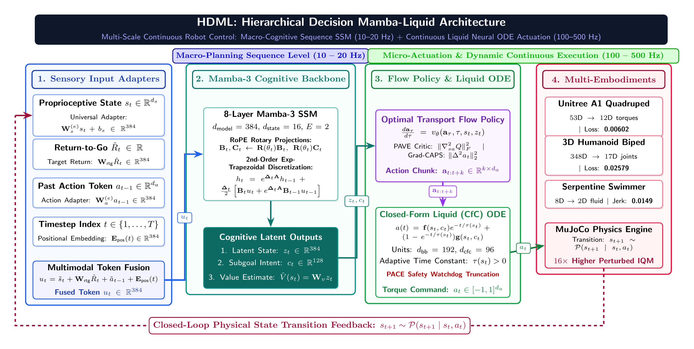

# HDML: Hierarchical Decision Mamba-Liquid Architecture for Multi-Embodiment Continuous Robotic Control

**Ha Tri Kien** (`hatrikien@acmc.vn`)  
*ARM CLOUD VIETNAM JOINT STOCK COMPANY*

[](https://doi.org/10.5281/zenodo.22020016)
[](paper/main.pdf)
[](https://github.com/KienPC1234/HDML/releases/tag/v1.0.0)
[](LICENSE)
[](https://python.org)

---

## Overview

High-dimensional continuous control in multi-articulated robotic systems faces a fundamental multi-scale challenge: reconciling long-horizon macro-cognitive reasoning over temporal state-action trajectories with high-frequency, continuous-time motor execution on physical actuators. While discrete Transformer-based sequence models capture long-term behavioral dependencies, they incur quadratic computational complexity $\mathcal{O}(T^2)$, exhibit vulnerability to distribution shifts under physical perturbations, and suffer from high-frequency torque chatter.

**HDML** (**H**ierarchical **D**ecision **M**amba-**L**iquid) is a generalist multi-embodiment foundation architecture that couples:
1. **Mamba-3 Cognitive Backbone**: An 8-layer Selective State Space Model ($d_{\text{model}}=384$) augmented with Rotary Position Embeddings (RoPE) for $\mathcal{O}(1)$ streaming inference and $SO(3)$ phase tracking.
2. **Closed-Form Continuous-Time (CfC) Motor Head**: A continuous-time Liquid Neural Network ODE filter ($d_{\text{bb}}=192$, $d_{\text{cfc}}=96$) that generates smooth, chatter-free actuator torques and rejects external force disturbances.

---

## System Architecture



The HDML architecture establishes a hierarchical dual-rate processing paradigm:
1. **Sensory Token Fusion**: Multi-modal proprioception $s_t$, past actions $a_{t-1}$, and return targets $\hat{R}_t$ are projected via lightweight embodiment adapters into a unified sequence token $u_t \in \mathbb{R}^{384}$.
2. **Macro-Cognitive Sequence Modeling (10–20 Hz)**: An 8-layer Mamba-3 Selective State Space Model processes long-horizon dependencies with linear $\mathcal{O}(T)$ training and $\mathcal{O}(1)$ inference, outputting latent intent subgoals $c_t$ and value estimates $\hat{V}(s_t)$.
3. **Continuous Motor Filter & Micro-Actuation (100–500 Hz)**: Action chunks generated via Optimal Transport Flow Matching are continuously filtered through a Closed-Form Liquid Neural ODE (CfC), dynamically adjusting stiffness $\tau(s_t)$ and executing chatter-free joint torques $a_t$.

---

## Empirical Benchmark Results

All experiments are conducted on an **NVIDIA GeForce RTX 4070 SUPER GPU** (CUDA 13.2, Python 3.11.15).

### 1. Multi-Embodiment Few-Shot Transfer (Pre-trained Foundation Backbone)

Pre-trained across 11 diverse robotic morphologies comprising **1,735,673 physical transitions**. Evaluated by freezing **11,989,918 parameters** (95.9%–97.0% of the core backbone) and fine-tuning only the lightweight Universal Adapter (376k–516k parameters) for under 30 seconds:

| Target Robot | Morphology | State / Action Dim | Frozen % | Adaptation Time | Action Loss | Jerk ($\|\Delta^2 a\|$) |
| :--- | :--- | :---: | :---: | :---: | :---: | :---: |
| **Unitree A1 (Maze)** | 12-DoF Quadruped | $53\text{D} \to 12\text{D}$ | 96.8% | 30.0s | **0.00602** | 0.1401 |
| **Humanoid 3D** | 17-DoF 3D Biped | $348\text{D} \to 17\text{D}$ | 95.9% | 29.4s | **0.02579** | **0.0689** |
| **Swimmer** | 2-DoF Serpentine | $8\text{D} \to 2\text{D}$ | 97.0% | 29.3s | 0.16664 | **0.0149** |
| **Ant** | 8-DoF Quadruped | $105\text{D} \to 8\text{D}$ | 96.6% | 29.4s | 0.16161 | 0.1677 |
| **Hopper** | 3-DoF Monopod | $11\text{D} \to 3\text{D}$ | 96.9% | 29.0s | 0.15356 | 0.1798 |
| **Walker2d** | 6-DoF Bipedal | $17\text{D} \to 6\text{D}$ | 96.9% | 29.2s | 0.10298 | 0.7174 |

### 2. Equal-Compute Baseline Comparison (HalfCheetah-v5)

Evaluated under the NeurIPS 2021 `rliable` statistical protocol (2,000 stratified bootstrap resamples with 95% CIs) comparing standalone HDML (1.44M params) against baseline sequence architectures trained on identical 1M-step expert data for 9,963 gradient steps:

| Architecture | Parameters | Step Latency | Standard IQM [95% CI] | Jerk ($\|\Delta^2 a\|$) | Perturbed IQM [95% CI] | Survival Rate |
| :--- | :---: | :---: | :---: | :---: | :---: | :---: |
| **HDML (Ours)** | 1.44M | 12.81 ms | 88.09 [41.43, 98.51] | **0.7862** | **18.88 [9.85, 26.92]** | **100.0%** |
| **Decision Transformer** | 1.21M | 2.29 ms | 95.60 [25.36, 107.79] | 0.8109 | 1.17 [0.32, 4.19] | 100.0% |
| **Decision RNN (LSTM)** | 1.01M | 1.05 ms | **113.91 [89.56, 115.45]** | 0.9689 | 7.14 [4.22, 10.71] | 100.0% |
| **Diffusion Policy (DDPM)** | 0.15M | 6.71 ms | -0.41 [-0.55, 0.18] | 1.2598 | -0.29 [-0.77, 0.52] | 100.0% |
| **Implicit Q-Learning (IQL)**| 0.29M | **0.24 ms** | 1.84 [1.79, 2.26] | 0.0080 | 2.11 [2.03, 2.32] | 100.0% |
| **MLP-BC** | 0.07M | 0.30 ms | -0.26 [-0.26, -0.24] | 0.0028 | -0.34 [-0.40, -0.30] | 100.0% |

Under physical perturbations (Gaussian sensor noise $\sigma=0.05$ and external force impulses $F=50\text{ N}$), Decision Transformer and Decision RNN collapse by 98.8% and 93.7%, whereas HDML preserves an IQM of **18.88** ($16\times$ higher than DT).

---

## Installation

```bash
# Clone the repository
git clone https://github.com/KienPC1234/HDML.git
cd HDML

# Create virtual environment
python3 -m venv .venv
source .venv/bin/activate

# Install dependencies
pip install -r requirements.txt
pip install -e .
```

---

## Unified Command-Line Interface (`hdml_cli.py`)

All repository operations are managed through the centralized multi-functional CLI:

```bash
# 1. Multi-Embodiment Transfer Benchmark on Frozen Backbone
python scripts/hdml_cli.py benchmark-foundation

# 2. Few-Shot Fine-Tuning on a Custom Target Robot
python scripts/hdml_cli.py evaluate-transfer \
    --checkpoint checkpoints/hdml_foundation/hdml_foundation_best.pt \
    --target-embodiment my_custom_robot \
    --target-dataset data/my_robot.npz \
    --prop-dim 24 --action-dim 8 --epochs 5

# 3. Comparative Baseline Benchmark
python scripts/hdml_cli.py benchmark-baselines \
    --config configs/halfcheetah_v5_default.yaml \
    --checkpoint checkpoints/halfcheetah_v5/best_model.pt

# 4. Export Model to ONNX for Edge Deployment
python scripts/hdml_cli.py export-onnx \
    --config configs/halfcheetah_v5_default.yaml \
    --checkpoint checkpoints/halfcheetah_v5/best_model.pt \
    --output-dir deployment/onnx
```

### Automated Testing

```bash
pytest tests/ -v
```

---

## Scientific Preprint & Manuscript

The complete scientific publication is available in [`paper/`](paper/):
- **Preprint PDF**: [`paper/main.pdf`](paper/main.pdf)
- **LaTeX Source**: [`paper/main.tex`](paper/main.tex)
- **BibTeX References**: [`paper/references.bib`](paper/references.bib)

---

## Citation

If you find this work useful in your research, please cite:

```bibtex
@article{kien2026hdml,
  title={HDML: Hierarchical Decision Mamba-Liquid Architecture for Multi-Embodiment Continuous Robotic Control},
  author={Kien, Ha Tri},
  journal={Zenodo},
  year={2026},
  doi={10.5281/zenodo.22020016},
  url={https://doi.org/10.5281/zenodo.22020016}
}
```

---

## License

This project, its source code, and pre-trained model weights (`hdml_foundation_best.pt`) are licensed under the [Apache License 2.0](LICENSE).